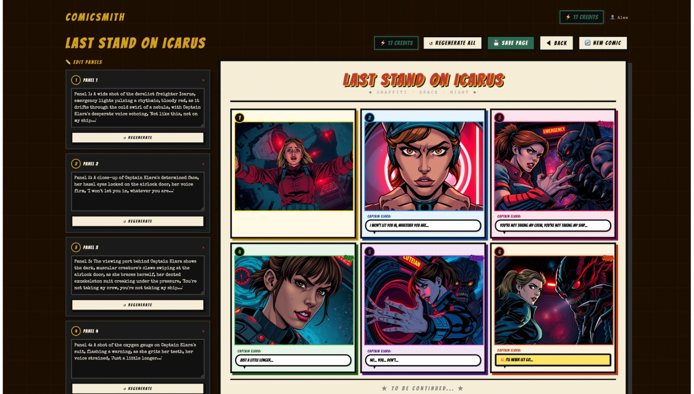

# ComicSmith 🎨 🤖
> **A Stateful Sequential Storytelling Platform for Writers.**

ComicSmith is an AI-powered comic generation engine built to solve the "continuity gap" in AI art. While most tools create isolated images, ComicSmith uses a **Stateful Orchestration Layer** to maintain character consistency and narrative flow across multiple panels, ensuring that the story you start is the story you finish.

[**Live Demo**](https://comicsmith.vercel.app/) | [**System Architecture**](./media//comicsmitharchitechture.png
) | [**wireframes**](https://www.figma.com/proto/enCXHcRexBeVHOb3H5arVc/Untitled?node-id=0-1&t=BomYrTyHFwDkETwt-1)

---
##  Examples of Output
 **Promt:** "The emergency lights of the derelict freighter Icarus pulse a rhythmic, bloody red. Captain Elara, clad in a dented exoskeleton suit, braces herself against the airlock door as the creature claws from the other side. Through the viewing port, the cold swirl of a nebula serves as the silent backdrop to her struggle. Her oxygen gauge is flashing a warning, but she refuses to let go of the lever."

 **Output:** 
 


---

## 🚀 The Product "Why" (Market Problem)
As a writer and comic enthusiast, I identified a significant friction in the current AI creative landscape:
* **Fragmentation:** Users must bounce between LLMs for scripts and Image Generators for art.
* **Lack of Persistence:** Standard models have no "memory," leading to **Character Drift** (characters changing appearance between panels).
* **High Barrier to Entry:** Prompt engineering is a technical skill that many storytellers lack.

**ComicSmith vertically integrates these steps into a single, cohesive workflow.**

---

## 🛠️ Architecture & Tech Stack
I designed this stack to prioritize **performance**, **cost-efficiency**, and **narrative memory**.

### Core Technologies
* **Narrative Engine:** **Groq LLM (Llama 3)** – Leveraged for its ultra-low latency (300+ tokens/sec) to provide instant script parsing.
* **Visual Engine:** **Cloudflare Workers AI** – Running Stable Diffusion at the edge for serverless, scalable image generation.
* **Frontend:** **Next.js & Tailwind CSS** – Providing a responsive, canvas-first user experience.
* **Persistence Layer:** **Vector Database** – Stores character embeddings and stylistic parameters to ensure visual continuity.

---

## 📈 Operational Observability (AI Gateway)
To transition this from a "project" to a "product," I implemented **Cloudflare AI Gateway**. This orchestration layer provides:

* **Caching:** Repeated prompts are served from the edge, reducing API costs and decreasing user wait times.
* **Analytics & Monitoring:** Real-time visibility into request latency, token consumption, and success rates.
* **Reliability:** Centralized logging to monitor model performance and manage provider fallbacks (Groq/Cloudflare).

---

## 📋 Key Features
* **Stateful Continuity:** The system "remembers" your characters. If your hero wears a red cloak in Panel 1, they wear it in Panel 10.
* **Integrated Lettering:** Automated dialogue placement based on the generated narrative script.
* **The Remix Loop:** One-click panel iteration allowing creators to refine visuals without losing the narrative state.
* **Style Steering:** Custom presets (Manga, Noir, Digital Art) that modify the underlying latent space for consistent aesthetics.

---

## 🧠 Product Manager Insights
### User Stories
* *As a Writer,* I want to describe a scene once so the AI can generate multiple panels without me re-entering prompts.
* *As a Creator,* I want to "save" a character’s visual identity so I can build a long-term graphic novel series.

### Design Decisions & Trade-offs
* **Latency vs. Quality:** Chose Groq for the LLM layer to ensure the "creative momentum" isn't broken by slow response times.
* **Constraint-Based UI:** Implemented fixed grid layouts to reduce user decision fatigue and ensure social-media-ready outputs.

---

## ⚙️ Installation & Setup

1. **Clone the repo:**
   ```bash
   git clone [https://github.com/yourusername/comicsmith.git](https://github.com/yourusername/comicsmith.git)
